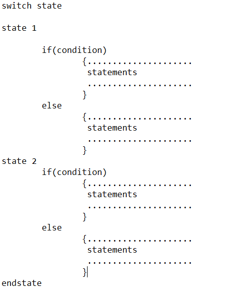
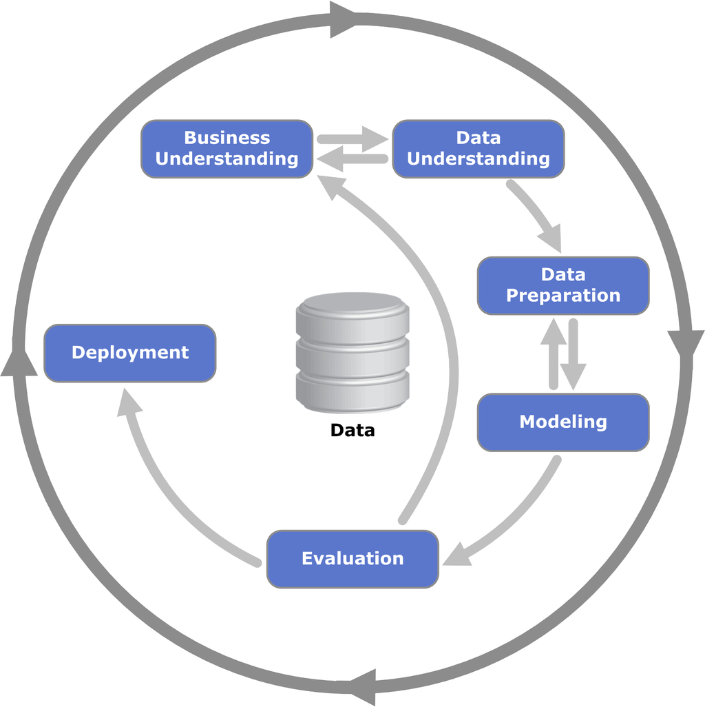

# Introduction

[Youtube - 1.1 à 1.10](https://www.youtube.com/watch?v=Crm_5n4mvmg&list=PL3MmuxUbc_hIhxl5Ji8t4O6lPAOpHaCLR&index=2)

[Github - DataTalksClub](https://github.com/DataTalksClub/machine-learning-zoomcamp/tree/master/01-intro)


## 1) Qu'est-ce que le ML ?

Le machine learning est un domaine de l'intelligence artificielle. Il consiste en la découverte de patterns dans des données pour pouvoir prédire une valeur-cible. 

Un modèle va transformer et extraite les informations des données qu'on lui fournit pour faire une prédiction. Les informations que l'on fournit aux modèles sont ce qu'on appelle des **features** et on va chercher à prédire une **cible**. Le modèle consiste en une fonction qui va avoir appris des patterns qu'il a trouvé dans les features.


| Exemples de features | Cible |
|----------------------|-------|
|Couleur, motorisation, nombre de portes, kilométrages, année de construction | Prix d'une voiture |
|Nombre de pièces, nombre de chambres, distance du centre-ville/plage, surface, année de construction | Prix d'une maison |
|Adresse mail expéditeur, objet, contenu du mail | Spam ou non spam |


**Ressource:**
- [Définition du Machine Learning](https://datascientest.com/machine-learning-tout-savoir)

## 2) Machine Learning vs Rule-Based Systems

Un système expert est capable de prendre des décisions à partir de règles pré-définies. Il est composé de trois parties :
- une base de faits
- une base de règles
- un moteur d'inférence

Le moteur d'inférence va être implémenter de manière itératif à partir de la base de faits et de règles. Cela va prendre la forme d'un algorithme à base de *If... Then*.



*Exemple d'algorithme d'un système expert.*

Plus on y ajoute de règles et de faits, plus le système devient complexe et difficilement maintenable. C'est dans ce type de situations que l'on préférera le machine learning. En effet, le machine learning va permettre de 
Après avoir obtenu des données, on définit et calcule des features puis on entraîne et utilise le modèle obtenu.

**Ressources:**
- [Difference between AI and Expert Systems](https://www.geeksforgeeks.org/difference-between-ai-and-expert-system/)
- [Machine Learning vs Expert Systems | Why it's better?](https://www.parascript.com/blog/machine-learning-ai-vs-expert-systems-ai/)

## 3) Apprentissage supervisé

L'apprentissage supervisé est une sous-catégorie de l'intelligence artificielle. Elle nécessite d'avoir obtenu des *features* et une *cible* pour pouvoir entraîner un modèle. 

L'entraînement consiste à ajuster les paramètres d'un algorithme pour l'aider à atteindre la cible. On retrouve plusieurs techniques d'apprentissage supervisé : 
- La régression (*prédiction du prix d'une voiture, d'une maison*)
- La classification (*binaire vs multiclasse*)
- Le ranking (*système de recommandation*)


**Ressources:** 
- [Supervised Learning Algorithms](https://towardsdatascience.com/supervised-learning-algorithms-explanaition-and-simple-code-4fbd1276f8aa)
- [Qu'est-ce que l'apprentissage supervisé ?](https://www.ibm.com/fr-fr/topics/supervised-learning)


## 4) Crisp-DM

Crisp-DM (CRoss Industry Standard Process for Data Mining) est une méthodologie utilisée pour les projets d'analyses de données. Elle se compose de 6 étapes : 
- la compréhension et l'expression d'un besoin business
- la compréhension des données qui va donner lieu à une phase d'exploration des données.
- la préparation des données qui découle de la compréhension des données
- la modélisation 
- l'évaluation du modèle
- le déploiement du modèle.

Cette méthodologie est itérative. On a notamment des aller-retours entre la compréhension du problème business et la compréhension des données et la préparation des données et la modélisation. L'évaluation du modèle demande aussi des retours sur l'étape de compréhension du problème métier pour être sûr que le modèle soit exploitable par les gens en ayant besoin.

/!\ *En général, la modélisation ne représente que 20% du travail d'un data scientist. La plus grande partie du travail d'un data scientist se trouve dans la compréhension et la préparation des données.*



**Ressources:**
- [Wikipédia - CRISP-DM](https://en.wikipedia.org/wiki/Cross-industry_standard_process_for_data_mining)
- [Data Science Process Alliance - CRISP-DM](https://www.datascience-pm.com/crisp-dm-2/)
- [CRISP-DM - IBM](https://www.ibm.com/docs/fr/spss-modeler/saas?topic=dm-crisp-help-overview)

## 5) Sélection de modèles

Pour effectuer la sélection du modèle le plus pertinent pour un problème, on va aussi suivre une démarche. Cela permet d'avoir quelque chose de robuste et de reproductible.

Tout d'abord, on va diviser les données en trois parts :
- Entrainement (60%)
- Validation (20%)
- Test (20%)

Après avoir fait les scores sur le jeu de validation, on va sélectionner un modèle et l'utiliser sur le jeu de test. On va observer les scores obtenus avec ce modèle. Si les scores sur le jeu de test sont proches de ceux du jeu de validation, on va pouvoir dire que notre modèle est le meilleur et qu'il ne souffre pas de phénomènes comme le **surapprentissage** (*overfitting*).

1) Séparation du jeu de données en trois parties
2) Entrainement des modèles sur le jeu d'entrainement
3) Validation du modèle sur le jeu de validation
4) Sélection du meilleur modèle sur la base des deux étapes différentes
5) Test du modèle sur le jeu de test
6) Vérification du modèle

Il est aussi possible de séparer le jeu de données seulement en deux parties : **entraînement** et **test**. Le modèle devrait être meilleur car il va s'entraîner sur plus de données 80% au lieu de 20%.

**Ressources:**
- [Model Selection](https://machinelearningmastery.com/a-gentle-introduction-to-model-selection-for-machine-learning/)
- [Difference between validation & test datasets](https://machinelearningmastery.com/difference-test-validation-datasets/)

- [Training, validation & test datasets : Wikipedia](https://en.wikipedia.org/wiki/Training,_validation,_and_test_data_sets)

## 6) Installation de l'environnement

[Installation de l'environnement](https://github.com/DataTalksClub/machine-learning-zoomcamp/blob/master/01-intro/06-environment.md)

## 7) Introduction à Numpy

**NumPy** est une librairy Python qui permet de faire du calcul scientifique. Il apporte une abstraction que l'on appelle *array*. Ces arrays permettent de créer des matrices à N-dimensions.  

- [Documentation Numpy](https://numpy.org/)
- [Notebook - Intro Numpy]()

## 8) Algèbre linéaire (base)

Si on cherche à multiplier un vecteur par 2, on multiplie chaque élément du vecteur par 2.
### a) Multiplication de vecteur par un vecteur

On appelle aussi cela un produit scalaire (*dot product*). Dans ce cas, on multiplie chaque élément d'un vecteur par les éléments de même indice dans un autre vecteur.

```math
\begin{bmatrix}
2\\
7\\
1
\end{bmatrix}
\cdot
\begin{bmatrix}
8\\
2\\
8
\end{bmatrix}
=
\begin{bmatrix}
2 \cdot 8\\
7 \cdot 2\\
1 \cdot 8
\end{bmatrix}
=
\begin{bmatrix}
16\\
14\\
8
\end{bmatrix}
```

Parfois, on peut se retrouver dans le cas où on veut faire un produit scalaire entre un vecteur ligne et un vecteur colonne.

```math
\begin{bmatrix}
2 & 7 & 1
\end{bmatrix}
\cdot
\begin{bmatrix}
8\\
2\\
8
\end{bmatrix}
```

Avant de pouvoir faire le calcul, il va falloir effectuer une opération que l'on appelle une transposée pour avoir la même forme de vecteur. On notera cela de la manière suivante : $u^T\cdot v$.

*Implémentation en Python*

```
def vector_vector_multiplication(u, v):
    assert u.shape[0] == v.shape[0]

    n = u.shape[0]
    result = 0.0

    for i in range(n):
        result = result + u[i] * v[i]

    return result
```

Dans Numpy, on peut utiliser ```u.dot(v)```.

### b) Multiplication d'une matrice par un vecteur

Pour chaque ligne de la matrice, on effectue sa transposée et on la multiplie par le vecteur.

```math
\begin{bmatrix}
2 & 4 & 5 & 6\\
1 & 2 & 1 & 2\\
3 & 1 & 2 & 1
\end{bmatrix}
\cdot
\begin{bmatrix}
1\\
0.5\\
2\\
1
\end{bmatrix}
=
\begin{bmatrix}
(2 \cdot 1) + (4 \cdot 0.5) + (5 \cdot 2) + (6 \cdot 1) \\
(1 \cdot 1) + (2 \cdot 0.5) + (1 \cdot 2) + (2 \cdot 1) \\
(3 \cdot 1) + (1 \cdot 0.5) + (2 \cdot 2) + (1 \cdot 1)
\end{bmatrix}
=
\begin{bmatrix}
2 + 2 + 10 + 6 \\
1 + 1 + 2 + 2 \\
3 + 0.5 + 4 + 1
\end{bmatrix}
= 
\begin{bmatrix}
20 \\
6 \\
8.5
\end{bmatrix}
```

*Implémentation en Python*

```
def matrix_vector_multiplication(U, v):
    assert U.shape[1] == v.shape[0]
    
    num_rows = U.shape[0]
    result = np.zeros(num_rows)
    
    for i in range(num_rows):
        result[i] = vector_vector_multiplication(U[i], v)
    
    return result
```

Avec Numpy, on utilisera ```U.dot(v)```.

### c) Mulitplication entre matrices

```math
\begin{bmatrix}
2 & 4 & 5 & 6\\
1 & 2 & 1 & 2\\
3 & 1 & 2 & 1
\end{bmatrix}
\cdot
\begin{bmatrix}
1 & 2 & 1\\
0 & 0.5 & 1\\
0 & 2 & 1 \\
2 & 1 & 0
\end{bmatrix}
= 
\begin{bmatrix}
(2 \cdot 1) + (4 \cdot 0) + (5 \cdot 0) + (6 \cdot 2)\\
(1 \cdot 2) + (2 \cdot 0.5) + (1 \cdot 2) + (2 \cdot 1)\\
(3 \cdot 1) + (1 \cdot 1) + (2 \cdot 1) + (1 \cdot 0) 
\end{bmatrix}
=
\begin{bmatrix}
2 + 0 + 0 + 12\\
2 + 1 + 2 + 2\\
3 + 1 + 2 + 0
\end{bmatrix}
=
\begin{bmatrix}
14\\
7\\
6
\end{bmatrix}
```

*Implémentation en Python*
```
def matrix_matrix_multiplication(U, V):
    assert U.shape[0] == V.shape[1]
    
    num_rows = U.shape[0]
    num_col = V.shape[1]
    
    result = np.zeros((num_rows, num_col))
    
    for i in range(num_col):
        vi = V[:, i]
        Uvi = matrix_vector_multiplication(U, i)
        result[:, i] = Uvi
    
    return result
```

### d) Matrice d'identité

Une matrice d'identité ou matrice unité est une matrice carrée diagonale dont la diagonale principale est remplie de 1, et dont les autres coefficients valent 0.

```math
I = 
\begin{bmatrix}
1 & 0 & 0 & 0\\
0 & 1 & 0 & 0\\
0 & 0 & 1 & 0\\
0 & 0 & 0 & 1
\end{bmatrix}
```

*Création en Python*
```
I = np.eye(4)
```

### e) Inversion

*Avec Numpy*
```np.linalg.inv()```

## 9) Introduction à Pandas

**Pandas** est une librairy Python qui permet de manipuler des données sous forme de tableau. 

- [Documentation Pandas](https://pandas.pydata.org/)
- [Notebook - Intro Pandas](https://github.com/cecilegltslmcs/ML-Zoomcamp/blob/main/Week1/Intro%20Pandas.ipynb)
- [Pandas - Cheatsheet](https://pandas.pydata.org/Pandas_Cheat_Sheet.pdf)
