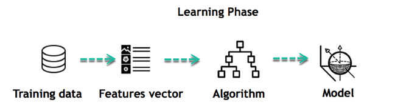
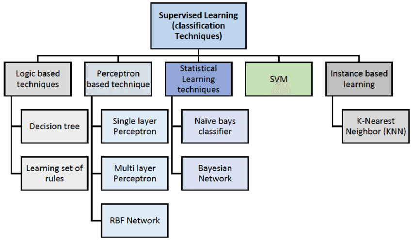

# Introduction

[Youtube - 1.1 à 1.10](https://www.youtube.com/watch?v=Crm_5n4mvmg&list=PL3MmuxUbc_hIhxl5Ji8t4O6lPAOpHaCLR&index=2)

[Github - DataTalksClub](https://github.com/DataTalksClub/machine-learning-zoomcamp/tree/master/01-intro)


## 1) Qu'est-ce que le ML ?

A partir de données, le modèle transforme et extrait les informations à partir de ces données pour faire des prédictions. Les features sont les informations que l'on a à disposition et la target (ou cible) constitue ce que l'on cherche à prédire.

Un modèle encapsule tout ce qu'il aura appris à partir des features dans les données.



Les données sont de deux types : les features et la cible (target). Le modèle encapsule ces deux objets pour pouvoir en déduire des patterns.

## 2) Machine Learning vs Rule-Based Systems

Un système basé sur des règles va s'implémenter en transcrivant des règles en code. Le souci de ce type de système c'est qu'il peut vite devenir complexe. Le processus est itératif car on va y ajouter des règles au fur et à mesure, des retraits de règles, etc.


*Exemple d'algorithme d'un système expert.*

On se retrouve avec quelque chose de difficile maintenable.   On va donc plutôt lui préférer le machine learning.
Après avoir obtenu des données, on définit et calcule des features puis on entraîne et utilise le modèle obtenu.

**Ressource:**
- [Difference between AI and Expert Systems](https://www.geeksforgeeks.org/difference-between-ai-and-expert-system/)

## 3) Apprentissage supervisé

On aura des features et une cible. On va chercher à entraîner une fonction qui prend comme paramètres les features pour pouvoir atteindre la cible/prédiction.
Il existe plusieurs types d'apprentissage supervisé :
- La régression (*prédiction du prix d'une voiture, d'une maison*)
- La classification :
    - Binaire
    - Multiclasse
- Le ranking (système de recommandation)



**Ressource:** 
- [Supervised Learning Algorithms](https://towardsdatascience.com/supervised-learning-algorithms-explanaition-and-simple-code-4fbd1276f8aa)

## 4) Crisp-DM


**Ressources:**
- [Wikipédia: CRISP-DM](https://en.wikipedia.org/wiki/Cross-industry_standard_process_for_data_mining)
- [Data Science Process Alliance: CRISP-DM](https://www.datascience-pm.com/crisp-dm-2/)
- [CRISP-DM par IBM](https://www.ibm.com/docs/fr/spss-modeler/saas?topic=dm-crisp-help-overview)

## 5) Sélection de modèles

Pour effectuer la sélection du modèle le plus pertinent pour un problème, on va suivre une démarche. 

Tout d'abord, on va diviser les données en trois parts : 
- Entrainement (60%)
- Validation (20%)
- Test (20%)

Après avoir fait les scorings sur le jeu de validation, on va sélectionner un modèle et l'utiliser sur le jeu de test. On va observer les scores obtenus avec ce modèle. Si les scores sur le jeu de test sont proches de ceux du jeu de validation, on va pouvoir dire que notre modèle est le meilleur.

6 étapes :
- Séparation du jeu de données en trois parties
- Entrainement des modèles sur le jeu d'entrainement
- Validation du modèle sur le jeu de validation
- Sélection du meilleur modèle sur la base des deux étapes différentes
- Test du modèle sur le jeu de test
- Vérification du modèle

Il est aussi possible de séparer le jeu de données seulement en deux parties : entraînement et test. Le modèle devrait être meilleur car il va s'entraîner sur plus de données 80% au lieu de 20%. 

**Ressources:**
- [Model Selection](https://machinelearningmastery.com/a-gentle-introduction-to-model-selection-for-machine-learning/)
- [Difference between validation & test datasets](https://machinelearningmastery.com/difference-test-validation-datasets/)

- [Training, validation & test datasets : Wikipedia](https://en.wikipedia.org/wiki/Training,_validation,_and_test_data_sets)

## 6) Installation de l'environnement

[Installation de l'environnement](https://github.com/DataTalksClub/machine-learning-zoomcamp/blob/master/01-intro/06-environment.md)

## 7) Introduction à Numpy

[Documentation Numpy](https://numpy.org/)
[Notebook - Intro Numpy]()

## 8) Algèbre linéaire (base)

Si on cherche à multiplier un vecteur par 2, on multiplie chaque élément du vecteur par 2.
### a) Multiplication de vecteur par un vecteur

On appelle aussi cela une produit scalaire (*dot product*). Dans ce cas, on multiplie chaque élément d'un vecteur par les éléments de même indice dans un autre vecteur.

```math
\begin{bmatrix}
2\\
7\\
1\\
\end{bmatrix}
\cdot
\begin{bmatrix}
8\\
2\\
8\\
\end{bmatrix}
=
\begin{bmatrix}
2 \cdot 8\\
7 \cdot 2\\
1 \cdot 8\\
\end{bmatrix}
=
\begin{bmatrix}
16\\
14\\
8\\
\end{bmatrix}
$$

Parfois, on peut se retrouver dans le cas où on veut faire un produit scalaire entre un vecteur ligne et un vecteur colonne.

$$
\begin{bmatrix}
2 & 7 & 1
\end{bmatrix}
\cdot
\begin{bmatrix}
8\\
2\\
8\\
\end{bmatrix}
```

Avant de pouvoir faire le calcul, il va falloir effectuer une opération que l'on appelle une transposée pour avoir la même forme de vecteur. On notera cela de la manière suivante : $u^T\cdot v$.

*Implémentation en Python*

```
def vector_vector_multiplication(u, v):
    assert u.shape[0] == v.shape[0]

    n = u.shape[0]
    result = 0.0

    for i in range(n):
        result = result + u[i] * v[i]

    return result
```

Dans Numpy, on peut utiliser ```u.dot(v)```.

### b) Multiplication d'une matrice par un vecteur

Pour chaque ligne de la matrice, on effectue sa transposée et on la multiplie par le vecteur.

$$
\begin{bmatrix}
2 & 4 & 5 & 6\\
1 & 2 & 1 & 2\\
3 & 1 & 2 & 1\\
\end{bmatrix}
\cdot
\begin{bmatrix}
1\\
0.5\\
2\\
1\\
\end{bmatrix}
=
\begin{bmatrix}
(2 \cdot 1) + (4 \cdot 0.5) + (5 \cdot 2) + (6 \cdot 1) \\
(1 \cdot 1) + (2 \cdot 0.5) + (1 \cdot 2) + (2 \cdot 1) \\
(3 \cdot 1) + (1 \cdot 0.5) + (2 \cdot 2) + (1 \cdot 1)
\end{bmatrix}
=
\begin{bmatrix}
2 + 2 + 10 + 6 \\
1 + 1 + 2 + 2 \\
3 + 0.5 + 4 + 1\\
\end{bmatrix}
= 
\begin{bmatrix}
20 \\
6 \\
8.5
\end{bmatrix}
$$

*Implémentation en Python*

```
def matrix_vector_multiplication(U, v):
    assert U.shape[1] == v.shape[0]
    
    num_rows = U.shape[0]
    result = np.zeros(num_rows)
    
    for i in range(num_rows):
        result[i] = vector_vector_multiplication(U[i], v)
    
    return result
```

Avec Numpy, on utilisera ```U.dot(v)```.

### c) Mulitplication entre matrices
--
$$
\begin{bmatrix}
2 & 4 & 5 & 6\\
1 & 2 & 1 & 2\\
3 & 1 & 2 & 1\\
\end{bmatrix}
\cdot
\begin{bmatrix}
1 & 2 & 1\\
0 & 0.5 & 1\\
0 & 2 & 1 \\
2 & 1 & 0
\end{bmatrix}
= 
\begin{bmatrix}
(2 \cdot 1) + (4 \cdot 0) + (5 \cdot 0) + (6 \cdot 2)\\
(1 \cdot 2) + (2 \cdot 0.5) + (1 \cdot 2) + (2 \cdot 1)\\
(3 \cdot 1) + (1 \cdot 1) + (2 \cdot 1) + (1 \cdot 0) 
\end{bmatrix}
=
\begin{bmatrix}
2 + 0 + 0 + 12\\
2 + 1 + 2 + 2\\
3 + 1 + 2 + 0\\
\end{bmatrix}
=
\begin{bmatrix}
14\\
7\\
6\\
\end{bmatrix}
$$

*Implémentation en Python*
```
def matrix_matrix_multiplication(U, V):
    assert U.shape[0] == V.shape[1]
    
    num_rows = U.shape[0]
    num_col = V.shape[1]
    
    result = np.zeros((num_rows, num_col))
    
    for i in range(num_col):
        vi = V[:, i]
        Uvi = matrix_vector_multiplication(U, i)
        result[:, i] = Uvi
    
    return result
```

### d) Matrice d'identité

Une matrice d'identité ou matrice unité est une matrice carrée diagonale dont la diagonale principale est remplie de 1 1, et dont les autres coefficients valent 0.

$$
I = 
\begin{bmatrix}
1 & 0 & 0 & 0\\
0 & 1 & 0 & 0\\
0 & 0 & 1 & 0\\
0 & 0 & 0 & 1
\end{bmatrix}
$$

*Création en Python*
```
I = np.eye(4)
```

### e) Inversion

*Avec Numpy*
```np.linalg.inv()```

## 9) Introduction à Pandas

[Documentation Pandas](https://pandas.pydata.org/)

[Notebook - Intro Pandas](https://github.com/cecilegltslmcs/ML-Zoomcamp/blob/main/Week1/Intro%20Pandas.ipynb)
